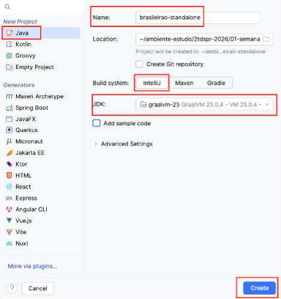
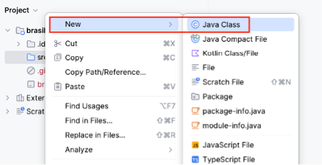
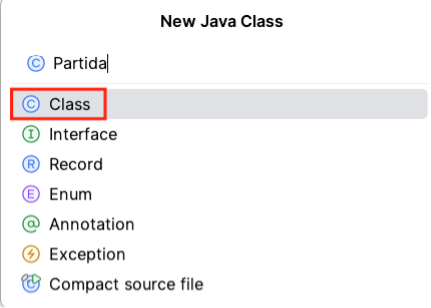
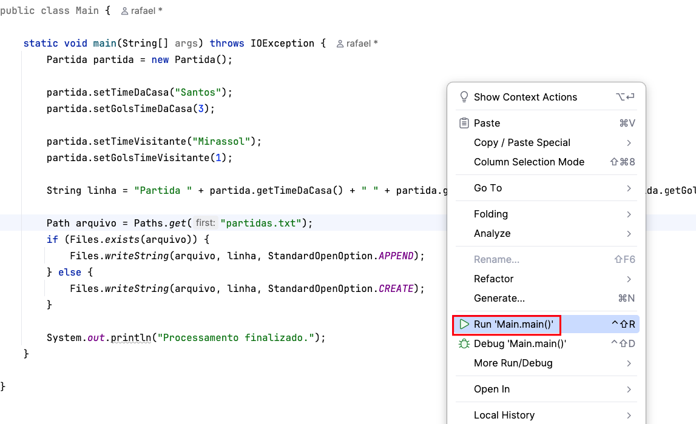
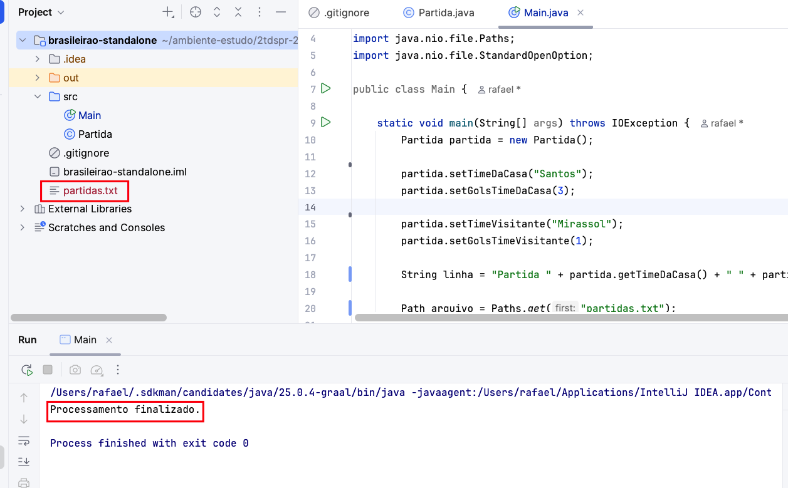
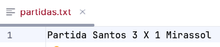
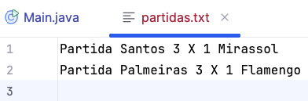
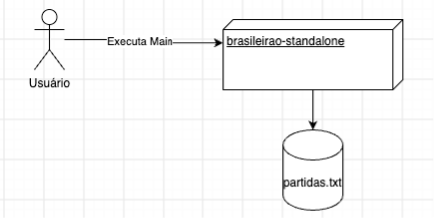

# Aula 01 — Primeira versão da aplicação

Na introdução da semana, conhecemos o problema que orientará a evolução da nossa aplicação: registrar partidas, placares e a classificação dos times no Campeonato Brasileiro.

Nesta aula, criaremos uma primeira versão reduzida da solução. O objetivo inicial será representar uma partida e persistir seu resultado em um arquivo de texto.

> Antes de começar, consulte a [introdução da primeira semana](../), na qual apresentamos o problema e o domínio da aplicação.

## Objetivos da aula

- criar uma aplicação Java standalone;
- representar uma partida por meio de uma classe;
- criar e manipular uma instância de `Partida`;
- formatar os dados de uma partida como texto;
- gravar e acrescentar informações em um arquivo;
- identificar limitações que orientarão as próximas versões.

## Problema

O objetivo completo da aplicação é registrar partidas, placares e calcular a classificação dos times no campeonato.

Para a primeira versão, trabalharemos com um escopo menor:

- registrar o time da casa;
- registrar o time visitante;
- registrar a quantidade de gols de cada time;
- persistir o resultado da partida em um arquivo de texto.

## Modelo de domínio inicial

Embora possamos identificar diferentes elementos no Campeonato Brasileiro, inicialmente representaremos apenas:

- `Partida`

Nesta versão, os times e os gols serão representados como atributos da própria partida. O modelo será evoluído quando surgirem novas necessidades.

## Criando a aplicação

### 1. Criar o projeto

Crie um novo projeto Java chamado `brasileirao-standalone`.


Selecione Java, escolha o JDK instalado e conclua a criação do projeto.



### 2. Criar a classe `Partida`

No diretório de código-fonte do projeto, crie uma classe Java chamada `Partida`.





### 3. Definir os atributos da partida

A classe `Partida` deverá armazenar:

- o time da casa;
- o time visitante;
- os gols do time da casa;
- os gols do time visitante.

```java
public class Partida {

    private String timeDaCasa;
    private String timeVisitante;

    private Integer golsTimeDaCasa;
    private Integer golsTimeVisitante;

    public String getTimeDaCasa() {
        return timeDaCasa;
    }

    public void setTimeDaCasa(String timeDaCasa) {
        this.timeDaCasa = timeDaCasa;
    }

    public String getTimeVisitante() {
        return timeVisitante;
    }

    public void setTimeVisitante(String timeVisitante) {
        this.timeVisitante = timeVisitante;
    }

    public Integer getGolsTimeDaCasa() {
        return golsTimeDaCasa;
    }

    public void setGolsTimeDaCasa(Integer golsTimeDaCasa) {
        this.golsTimeDaCasa = golsTimeDaCasa;
    }

    public Integer getGolsTimeVisitante() {
        return golsTimeVisitante;
    }

    public void setGolsTimeVisitante(Integer golsTimeVisitante) {
        this.golsTimeVisitante = golsTimeVisitante;
    }

    @Override
    public String toString() {
        return "Partida{" +
                "timeDaCasa='" + timeDaCasa + '\'' +
                ", golsTimeDaCasa=" + golsTimeDaCasa +
                ", timeVisitante='" + timeVisitante + '\'' +
                ", golsTimeVisitante=" + golsTimeVisitante +
                '}';
    }
}
```

### 4. Criar a classe `Main`

Crie a classe `Main`, responsável por iniciar a aplicação, instanciar uma partida e definir seus dados.

```java
import java.io.IOException;

public class Main {

    public static void main(String[] args) throws IOException {
        Partida partida = new Partida();

        partida.setTimeDaCasa("Time da Casa");
        partida.setGolsTimeDaCasa(3);

        partida.setTimeVisitante("Time Visitante");
        partida.setGolsTimeVisitante(1);
    }

}
```

### 5. Formatar a linha do arquivo

Crie uma variável do tipo `String` para representar uma linha do arquivo de partidas.

```java
String linha = "Partida " + partida.getTimeDaCasa() + " " + partida.getGolsTimeDaCasa() + " X " + partida.getGolsTimeVisitante() + " " + partida.getTimeVisitante() + "\n";
```

### 6. Persistir o resultado

Depois de formatar a linha, verifique se o arquivo existe. Se ele ainda não existir, crie-o; caso contrário, acrescente o novo resultado ao conteúdo existente.

```java
Path arquivo = Paths.get("partidas.txt");
        if (Files.exists(arquivo)) {
            Files.writeString(arquivo, linha, StandardOpenOption.APPEND);
        } else {
            Files.writeString(arquivo, linha, StandardOpenOption.CREATE);
        }
```

### 7. Executar a aplicação

Execute o método `main` pelo IntelliJ IDEA.

<!-- Esta imagem pode ser substituída por código ou mantida para mostrar a execução na IDE. -->



### 8. Verificar o processamento

Ao final da execução, a aplicação apresentará a mensagem `Processamento finalizado.`.



### 9. Conferir o arquivo

Abra o arquivo `partidas.txt` e confira o resultado registrado.



### 10. Registrar outra partida

Nesta primeira versão, para registrar uma nova partida, alteramos os dados definidos na classe `Main` e executamos novamente a aplicação.

```java
import java.io.IOException;
import java.nio.file.Files;
import java.nio.file.Path;
import java.nio.file.Paths;
import java.nio.file.StandardOpenOption;

public class Main {

    static void main(String[] args) throws IOException {
        Partida partida = new Partida();

        partida.setTimeDaCasa("Palmeiras");
        partida.setGolsTimeDaCasa(3);

        partida.setTimeVisitante("Flamengo");
        partida.setGolsTimeVisitante(1);

        String linha = "Partida " + partida.getTimeDaCasa() + " " + partida.getGolsTimeDaCasa() + " X " + partida.getGolsTimeVisitante() + " " + partida.getTimeVisitante() + "\n";

        Path arquivo = Paths.get("partidas.txt");
        if (Files.exists(arquivo)) {
            Files.writeString(arquivo, linha, StandardOpenOption.APPEND);
        } else {
            Files.writeString(arquivo, linha, StandardOpenOption.CREATE);
        }

        System.out.println("Processamento finalizado.");
    }

}
```

### 11. Conferir o arquivo atualizado

Depois da nova execução, o arquivo conterá as duas partidas.



## Visão geral da primeira versão

O usuário executa a classe `Main`, a aplicação processa os dados definidos no código e grava o resultado no arquivo `partidas.txt`.



## Revisão

Com base no domínio e no problema que queremos resolver, criamos uma aplicação Java standalone capaz de:

- representar uma partida por meio da classe `Partida`;
- criar uma instância e definir seus dados na classe `Main`;
- formatar o resultado como texto;
- persistir os dados no arquivo `partidas.txt`;
- acrescentar novas partidas ao arquivo existente.

## Limitações da primeira versão

Nossa primeira implementação funciona, mas ainda possui algumas limitações:

- os dados das partidas estão definidos diretamente no código;
- é necessário alterar e executar novamente a classe `Main` para cada partida;
- os times ainda não possuem uma representação própria;
- os dados são armazenados em um arquivo de texto;
- a classificação dos times ainda não é calculada.

Essas limitações não representam apenas problemas: elas indicam quais podem ser as próximas evoluções da aplicação.

## Navegação

⬅️ [Voltar para a primeira semana](../)
