# Java Advanced — Semana 1, aula 2

Nesta aula, continuaremos a evolução da aplicação do Campeonato Brasileiro. A aplicação, que antes era executada localmente pela classe `Main`, passará a receber requisições HTTP por meio de uma API REST desenvolvida com Spring Boot e Spring Web.

## Objetivos de aprendizagem

- explicar a diferença entre uma aplicação standalone e uma aplicação web;
- reconhecer os principais elementos de uma comunicação HTTP;
- relacionar métodos HTTP às operações de um CRUD;
- criar um projeto Spring Boot com a dependência Spring Web;
- implementar um controller REST para o recurso `Partida`;
- explicar as responsabilidades iniciais das camadas Controller, Service e Repository.

## Pré-requisitos

- JDK instalado;
- IDE configurada;
- projeto da aula anterior disponível;
- ferramenta para testar requisições HTTP, como Postman, Insomnia ou o cliente HTTP da IDE.

## 1. Retomando o problema

Imagine que alguém peça o desenvolvimento de uma aplicação capaz de registrar:

- os times do campeonato;
- as partidas disputadas;
- a quantidade de gols de cada time;
- a classificação dos times.

### Domínio

O **domínio** representa a área de conhecimento na qual existe o problema que queremos resolver. Neste exemplo, trabalharemos com o domínio de um campeonato de futebol inspirado no Campeonato Brasileiro.

> O domínio é o campeonato; o problema é registrar partidas, resultados e, futuramente, calcular a classificação.

### Modelo de domínio

O modelo de domínio representa os elementos relevantes do problema e as relações entre eles. Inicialmente, identificamos o conceito de **Partida**. À medida que novas necessidades surgirem, o modelo poderá evoluir para incluir conceitos como `Time`, `Campeonato` e `Classificacao`.

Na aula anterior, desenvolvemos uma aplicação Java standalone cuja execução era iniciada pela classe `Main`.

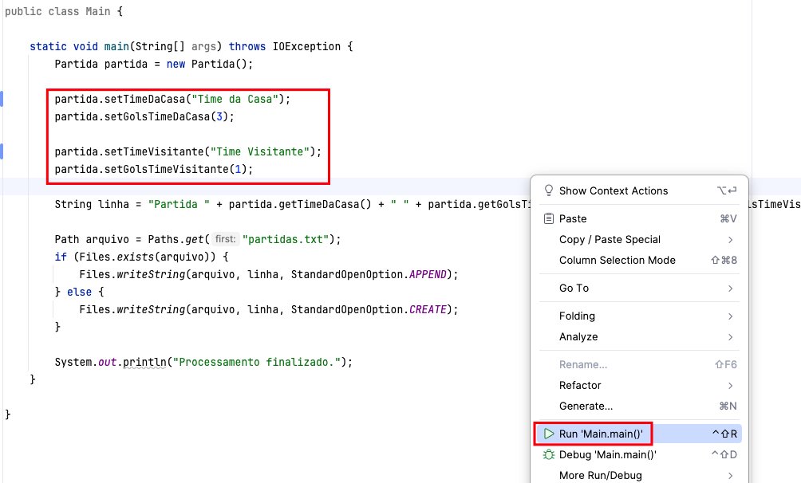

Nesse modelo, a aplicação precisa estar disponível e ser executada na própria máquina do usuário. Agora, evoluiremos essa solução para uma aplicação web.

## 2. De uma aplicação standalone para uma aplicação web

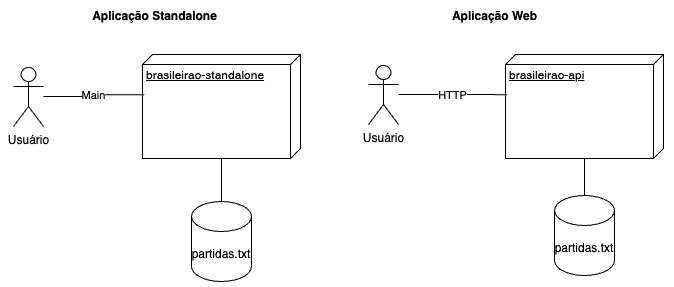

Na aplicação standalone, a interface e a lógica geralmente são executadas na máquina do usuário. Em uma aplicação web, o cliente e o servidor podem estar em máquinas diferentes e precisam se comunicar pela rede.

Essa comunicação normalmente acontece por meio do protocolo **HTTP**.

## 3. Fundamentos de HTTP

HTTP é um protocolo de comunicação baseado em requisições e respostas:

1. o cliente envia uma **requisição** (*request*);
2. o servidor processa a solicitação;
3. o servidor devolve uma **resposta** (*response*).

### 3.1 Métodos HTTP

| Método | Operação no CRUD | Uso comum |
| --- | --- | --- |
| `GET` | Read | Consultar um ou mais recursos |
| `POST` | Create | Criar um novo recurso |
| `PUT` | Update | Substituir ou atualizar integralmente um recurso |
| `DELETE` | Delete | Remover um recurso |

> Em APIs reais, também é comum utilizar `PATCH` para atualizações parciais. Nesta aula, utilizaremos `PUT` para manter o foco no CRUD inicial.

### 3.2 Cabeçalhos HTTP

Os cabeçalhos transportam informações adicionais sobre a requisição ou a resposta.

Exemplos:

- `Content-Type`: informa o formato do corpo enviado, como `application/json`;
- `Accept`: informa quais formatos de resposta o cliente aceita;
- `Authorization`: transporta credenciais ou tokens de acesso quando a API exige autenticação.

### 3.3 Códigos de status

| Faixa | Categoria | Exemplos |
| --- | --- | --- |
| `100–199` | Informativa | Continuação do processamento |
| `200–299` | Sucesso | `200 OK`, `201 Created`, `204 No Content` |
| `300–399` | Redirecionamento | `301 Moved Permanently` |
| `400–499` | Erro do cliente | `400 Bad Request`, `404 Not Found` |
| `500–599` | Erro do servidor | `500 Internal Server Error` |

Para o CRUD de partidas, alguns retornos esperados são:

- `200 OK` ao consultar ou atualizar uma partida;
- `201 Created` ao cadastrar uma partida;
- `204 No Content` ao excluir uma partida;
- `404 Not Found` quando a partida solicitada não existir.

### 3.4 Mensagens HTTP

Uma requisição contém, entre outros elementos, o método, o endereço do recurso, os cabeçalhos e, quando necessário, um corpo.

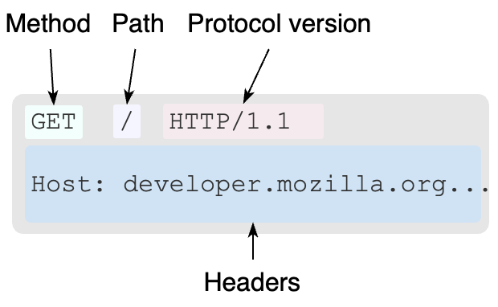

A resposta contém um código de status, cabeçalhos e, opcionalmente, um corpo.

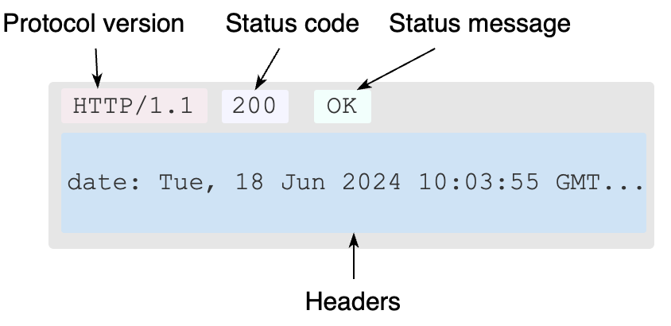

## 4. API REST

REST é um estilo arquitetural usado na construção de sistemas distribuídos. Em uma API REST, os dados são expostos como **recursos**, identificados por URLs, e manipulados por meio da semântica dos métodos HTTP.

Em nossa aplicação, `Partida` será um recurso. Uma possível URL para sua coleção é:

```text
/partidas
```

Operações planejadas:

| Ação | Método | URL |
| --- | --- | --- |
| Listar partidas | `GET` | `/partidas` |
| Consultar uma partida | `GET` | `/partidas/{id}` |
| Cadastrar uma partida | `POST` | `/partidas` |
| Atualizar uma partida | `PUT` | `/partidas/{id}` |
| Excluir uma partida | `DELETE` | `/partidas/{id}` |

## 5. Criando a aplicação Spring Boot

### 5.1 Criar o projeto

No Spring Initializr, crie um novo projeto chamado `brasileirao-api`.

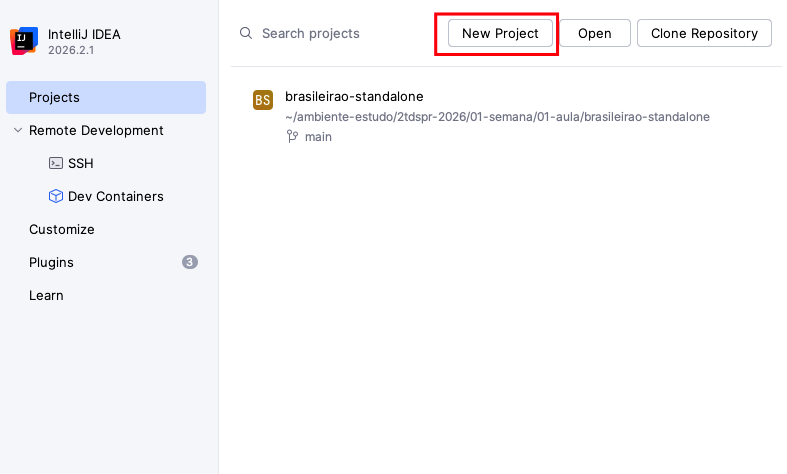

### 5.2 Configurar os dados do projeto

Defina o grupo, o artefato, o nome do projeto, a versão do Java e o formato de empacotamento.

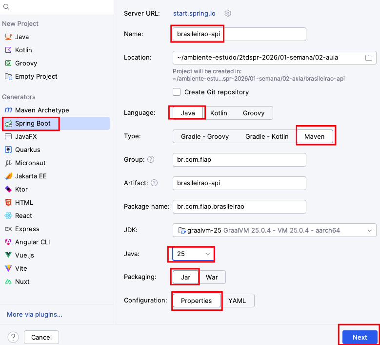

### 5.3 Adicionar o Spring Web

Selecione a dependência **Spring Web**. Ela fornece os componentes necessários para criar aplicações web e APIs REST com Spring MVC.

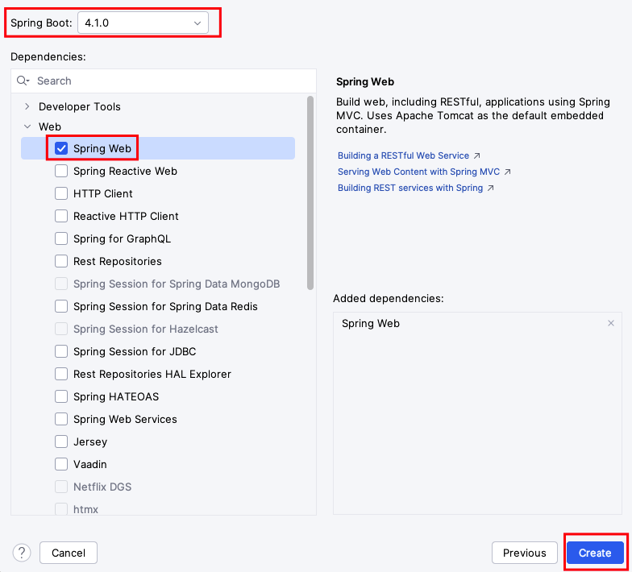

## 6. Criando o controller de partidas

O controller será o ponto de entrada das requisições HTTP relacionadas ao recurso `Partida`.

```java
package br.com.fiap.brasileirao;

import org.springframework.web.bind.annotation.RequestMapping;
import org.springframework.web.bind.annotation.RestController;

@RestController
@RequestMapping("/partidas")
public class PartidaResource {

    
}
```

### Anotações principais

- `@RestController`: indica que a classe recebe requisições HTTP e que os valores retornados pelos métodos serão escritos no corpo da resposta;
- `@RequestMapping`: define o caminho-base atendido pelo controller;
- `@GetMapping`: associa um método Java a requisições `GET`;
- `@PostMapping`: associa um método Java a requisições `POST`;
- `@PutMapping`: associa um método Java a requisições `PUT`;
- `@DeleteMapping`: associa um método Java a requisições `DELETE`;
- `@RequestBody`: converte o corpo JSON da requisição em um objeto Java;
- `@PathVariable`: captura um valor presente na URL.

### Operações CRUD

Implemente os métodos que receberão as requisições do CRUD de partidas.

```java
package br.com.fiap.brasileirao;

import org.springframework.http.HttpStatus;
import org.springframework.http.MediaType;
import org.springframework.http.ResponseEntity;
import org.springframework.web.bind.annotation.*;

@RestController
@RequestMapping("/partidas")
public class PartidaResource {

    @PostMapping(consumes = MediaType.APPLICATION_JSON_VALUE, produces = MediaType.APPLICATION_JSON_VALUE)
    public ResponseEntity cadastrar(@RequestBody Partida novaPartida) {
        System.out.println("Cadastrando Partida ...");
        return ResponseEntity.status(HttpStatus.CREATED.value()).build();
    }

    @PutMapping(path = "/{codigo}", consumes = MediaType.APPLICATION_JSON_VALUE, produces = MediaType.APPLICATION_JSON_VALUE)
    public ResponseEntity atualizar(@PathVariable Long codigo, @RequestBody Partida partida) {
        System.out.println("Atualizando Partida [" + codigo + "]");
        return ResponseEntity.ok().build();
    }

    @GetMapping(produces = MediaType.APPLICATION_JSON_VALUE)
    public ResponseEntity<Partida> consultar() {
        System.out.println("Consultando Partida ...");

        Partida partida = new Partida();
        partida.setTimeDaCasa("Time da Casa");
        partida.setGolsTimeDaCasa(2);

        partida.setTimeVisitante("Time Visitante");
        partida.setGolsTimeVisitante(1);

        return ResponseEntity.ok(partida);
    }

    @DeleteMapping(path = "/{codigo}", produces = MediaType.APPLICATION_JSON_VALUE)
    public ResponseEntity excluir(@PathVariable Long codigo) {
        System.out.println("Excluindo Partida [" + codigo + "]");
        return ResponseEntity.noContent().build();
    }
}
```

> Nesta primeira versão, o objetivo é compreender o fluxo HTTP e o mapeamento das requisições. Persistência, validações e tratamento completo de erros serão incorporados durante a evolução da aplicação.

## 7. Executando e testando a aplicação

Inicie a aplicação pela classe principal do Spring Boot e confirme, no console, que o servidor foi iniciado sem erros.

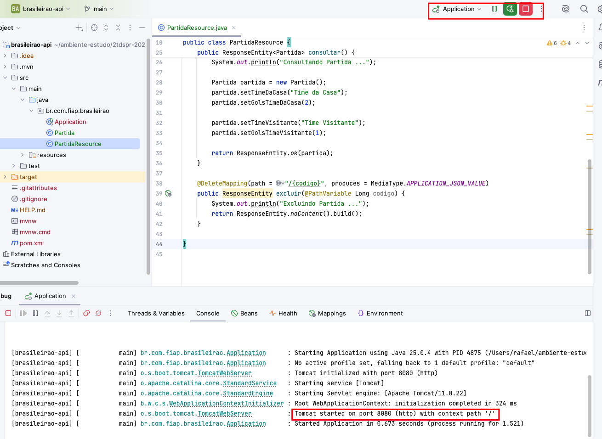

### 7.1 Cadastrar uma partida

Envie uma requisição `POST` para `/partidas`, informando a partida em JSON no corpo da requisição.

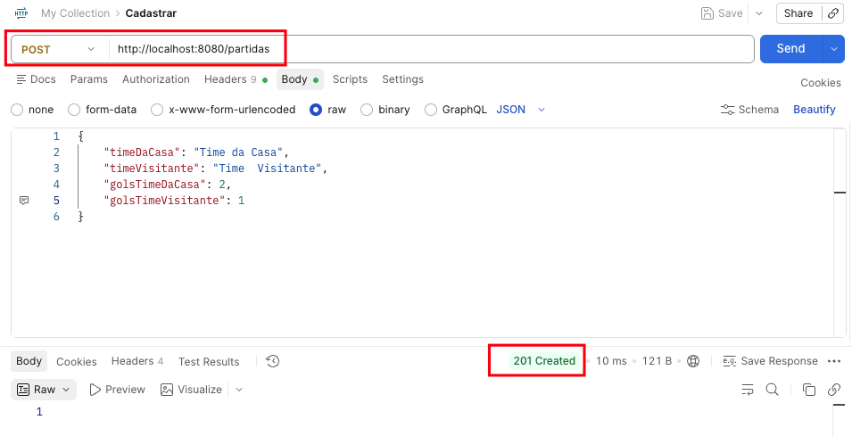

### 7.2 Atualizar uma partida

Envie uma requisição `PUT` para `/partidas/{codigo}` com os dados atualizados.

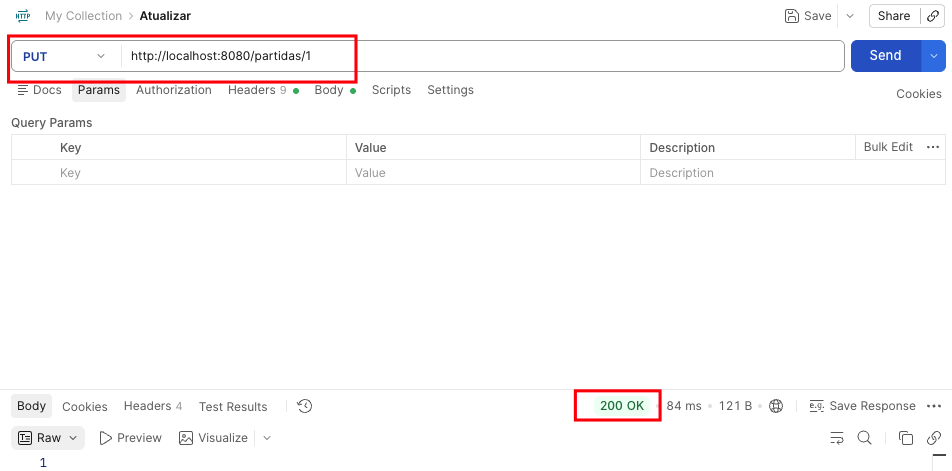

### 7.3 Consultar uma partida

Envie uma requisição `GET` para `/partidas/{codigo}`.

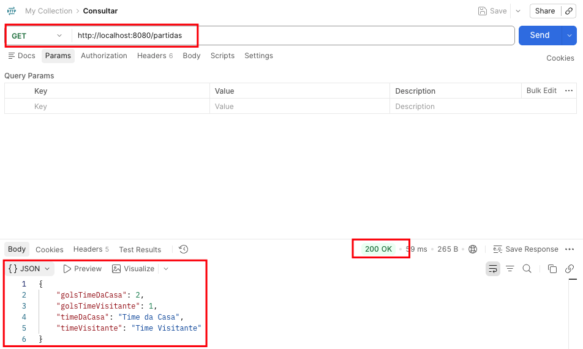

### 7.4 Excluir uma partida

Envie uma requisição `DELETE` para `/partidas/{codigo}`.

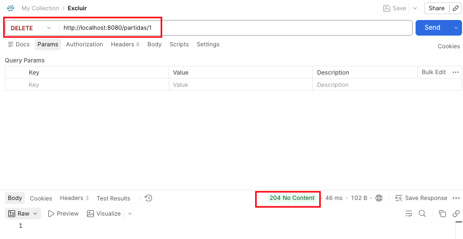

## 8. Organização em camadas

À medida que uma aplicação cresce, concentrar todas as responsabilidades no controller dificulta a manutenção e os testes. Uma organização inicial comum em aplicações Spring separa o código em camadas.

### Controller

Recebe as requisições HTTP, converte os dados de entrada e constrói a resposta. Deve delegar a execução dos casos de uso à camada de serviço.

### Service

Coordena os casos de uso e aplica as regras de negócio. Faz a intermediação entre o controller e o acesso aos dados.

### Repository

Abstrai o acesso aos dados, permitindo consultar e persistir os objetos da aplicação.

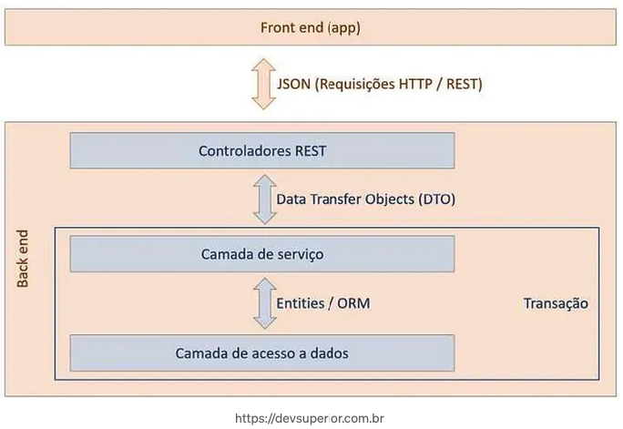

O fluxo básico será:

```text
Requisição HTTP → Controller → Service → Repository
Resposta HTTP  ← Controller ← Service ← Repository
```

> A separação em camadas é uma decisão de organização, não uma exigência do Spring. As dependências devem apontar para dentro do fluxo da aplicação; isso não significa que cada classe precise se comunicar apenas com uma classe “adjacente” em todas as arquiteturas.

## 9. Desafio prático

Implemente uma operação para **listar todas as partidas**:

1. defina a URL e o método HTTP adequados;
2. crie o método correspondente no controller;
3. execute a aplicação;
4. teste a requisição;
5. confirme o código de status e o corpo da resposta.

### Questões para discussão

- Por que `GET /partidas` representa melhor uma consulta do que `POST /consultarPartidas`?
- O que deverá acontecer quando o cliente consultar um identificador inexistente?
- Qual problema surgirá se os dados permanecerem armazenados apenas em memória?
- Quais responsabilidades não deveriam ficar no controller?

## 10. Revisão da aula

Nesta aula:

- retomamos o domínio do campeonato e o recurso `Partida`;
- comparamos aplicações standalone e web;
- estudamos requisições, respostas, métodos, cabeçalhos e códigos de status HTTP;
- criamos uma API REST com Spring Boot e Spring Web;
- mapeamos operações CRUD para endpoints HTTP;
- conhecemos as responsabilidades iniciais de Controller, Service e Repository.

## 11. Branches

- 01-semana/02-aula/02-consultando-lista-partidas `CRUD manipulando dados de uma lista de partidas`
- 01-semana/02-aula/03-modelo-camadas `Exemplo modelo em camadas consultando uma lista de partidas`

## Próxima evolução

Na próxima etapa, poderemos substituir o armazenamento temporário por persistência em banco de dados, introduzir a camada Repository e melhorar os retornos HTTP e o tratamento de erros.

## Referências

- [Visão geral do HTTP — MDN Web Docs](https://developer.mozilla.org/pt-BR/docs/Web/HTTP/Overview)
- [Métodos de requisição HTTP — MDN Web Docs](https://developer.mozilla.org/pt-BR/docs/Web/HTTP/Methods)
- [Códigos de status HTTP — MDN Web Docs](https://developer.mozilla.org/pt-BR/docs/Web/HTTP/Status)
- [Spring — Building a RESTful Web Service](https://spring.io/guides/gs/rest-service)